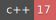

[](https://git.informatik.tu-freiberg.de/jtoth/master-thesis/commits/master)
[](https://git.informatik.tu-freiberg.de/jtoth/master-thesis/commits/master)
[](https://en.wikipedia.org/wiki/C%2B%2B#Standardization)
[](https://git.informatik.tu-freiberg.de/jtoth/master-thesis/-/archive/master/master-thesis-master.tar.gz)
[](https://i.kym-cdn.com/entries/icons/original/000/000/091/TrollFace.jpg)

# master-thesis

Repository containing all code and stuff for my master thesis.
For more specific documentation check the `docs/` directory.

## What is this

Goal of this project is to localize depth image in a known 3D model.
This model can either be a laserscan, a reconstructed mesh or a dense
pointcloud.

All the science for that will be written in my master thesis.

## Examples

For in-depth usage examples of the provided tools check `docs/examples.md`.

```bash
$ ls
> .. a bunch of orthographic depth maps AND and intrinsic file ..
> depth_0000.png depth_0001.png depth_0002.png ...
> intrinsic.txt

$ cat intrinsic.txt  # example intrinsic for a kinect pinhole image
> 960 540                       # == <width> <height>
> 519.226 0.000000 479.462      # == <fx> ignored <cx>
> 0.000000 522.23 272.737       # == ignored <fy> <cy>
> 0.000000 0.000000 1.000000    # this line is ignored

$ depth2x flexion \
    --calibration intrinsic.txt \
    --input depth_{:04d}.png \
    --type pinhole-depth \
    --start 0 \
    --end 100 \
    --output flexion_{:04d}.png

$ ls
> .. still a bunch of orthographic depth maps and the intrinsic file ..
> .. with additional a bunch of flexion images ..
> flexion_0000.png flexion_0001.png flexion_0002.png ...
```

## Getting the software

You can download the source code and compile it on your own system. This allows
for the most customization and most control over the final executable. This
project tries to support many compilers and environment but is very Linux
oriented. For more information on building see the
[Compilation Reference](docs/compilation.md).

It is possible to download artifacts from the CI setup. See the
[Pipelines Page](https://git.informatik.tu-freiberg.de/jtoth/master-thesis/pipelines?scope=branches&page=1)
that provides a download link for the artifacts. If there is no artifact that
works on your system you need to fall back to compiling on your own.

Please note, that artifacts from the `platform` stage require `libjpeg-dev` and
`libpng-dev` libraries as they are dynamically linked.
On Linux system you can check `ldd <binary-executable>` if all dynamic
dependencies are resolved. If yes, the binary should work, given the `libc` is
new enough ;)

Using a `docker` container with `ubuntu:18.04` should definitly work! More
robust ways to distribute, e.g. packages, are implemented when necessary and
time allows it.

## Contributing

Right now, not so much. As this is part of my master thesis I need to develop
it on my own. Bug Reports are of course always welcome!
